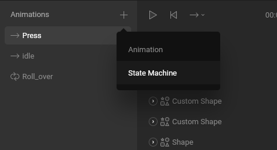
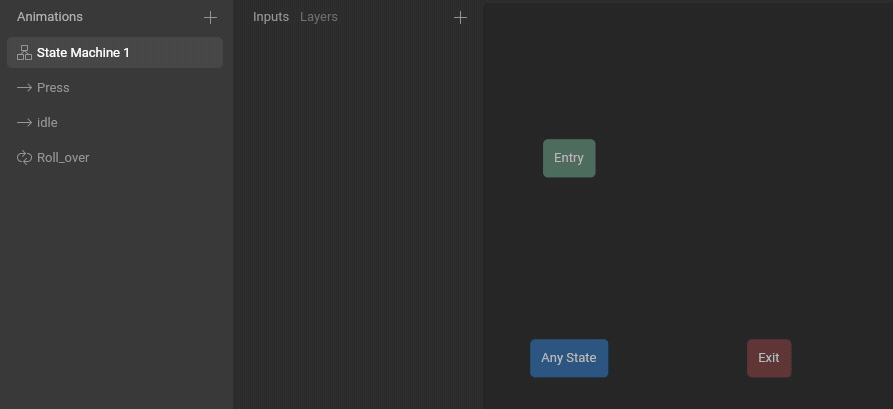

# State Machine

The State Machine feature is a visual way to connect animations together and define the logic that drives the transitions, all without code.

This allows you to build interactive motion graphics that transition and mix animations based on events and user interactions.



## Create a state machine

To get started, you first need some timeline-based animations.

Then create a state machine.

### States

With the state machine selected, drag and drop your animations onto the graph on the right.

### Create transitions

Connect your new states with transitions. When you hover near a state, you'll see a dot appear. Click and drag on that dot to draw a transition from one state to another. The transition from the **Entry** state defines which state should play first. A transition from the **Any State** will happen regardless of what state is currently active, provided the conditions on that transition are met \(read below for more on conditions\). A transition to the **Exit** state will exit the state machine.

### Inputs

Before adding logic to the transitions, you need to create at least one Input. Inputs are values that can be manipulated when the state machine is playing. You can change these values while the state machine is playing in the Editor or at runtime in your app, game, or website. In this case, we're going to use this Input to determine when a button is pressed, so we're going to name it "Pressed."

### Transition properties

Select a transition to view its properties.

**Duration** determines how long the two animations \(in this case Idle and Press\) will mix. A value of 0 has no mixing and instantly changes from one state to the next. Duration can be a fixed time value \(milliseconds or seconds\) or it can be a percentage \(based on the length of the beginning state\). 

**Exit Time** determines how much time must pass before the transition can happen \(even if the conditions have already been met\). This can be useful if you have an animation that needs to reach a specific point before it can transition. You can use time values \(milliseconds or seconds\) or a percentage. A value of 100% means that the transition can only happen once the entire animation has played.

Use **Pause When Exiting** if you want to hold the current frame \(of the beginning state\) when the transition started.

### Conditions

A transition can have no conditions, one condition, or multiple conditions. If it has no conditions, then the transition happens as soon as **Exit Time** has been reached. If a transition has any condition, then all conditions must be met before the transition happens.

If you have **Exit Time** enabled, then the transition happens once all conditions are met and the exit time has been reached. Use this to ensure your transition happens at a specific time of your animation.

### Play the state machine

Press the play button to start the state machine. Change the Inputs to test how your state machine responds.

