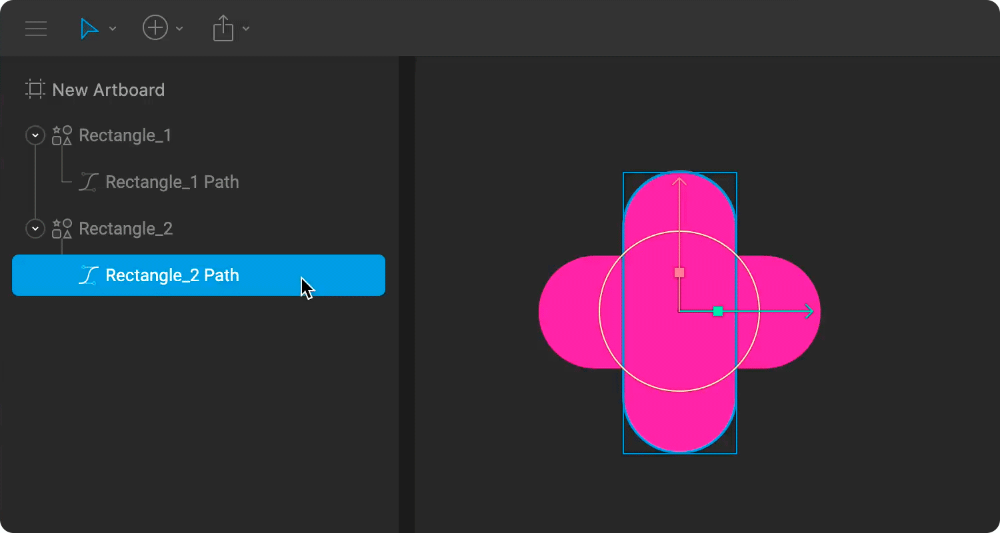

# Shapes and Paths

Rive allows you to create, edit, and animate vector graphics using either procedural or custom shapes. These graphics combine shape and path layers to define them, which Rive exposes to give you greater flexibility and control with your designs and animations.

To learn more about Shape and Path layers, watch our video on Shapes and Paths, or read more below.



## **Shape layer**

Vectors in Rive are rendered on shape layers. Shape layers define the style of the shape by allowing you to customize the fill and stroke.

### **Shape layer properties**

The shape layer displays many properties in the inspector that can be edited in both design and animate mode. These properties include Position, Scale, and Rotation, as well as additional styling properties like Fill and Stroke.

## **Path layer**

The actual shape of a vector is defined by a path \(or multiple paths\). Expanding a shape layer in Rive will reveal the paths it's using.

‌ You can add new paths to any shape by dragging and dropping an existing path onto the desired shape layer. 

### **Path layer properties**

The path layer displays many properties in the Inspector that can be edited in both Design and Animate mode but differ slightly based on the type of path. While both custom and procedural paths display position, scale, and rotation, procedural paths are unique in that they display height and width properties.

## Enter and Esc shortcuts

Use the `Enter` key to quickly navigate down the Hierarchy. If you have a shape selected, this allows you to quickly select the child path layer.

Use the `Esc` key to quickly navigate up the Hierarchy. If you have a path selected, this allows you to quickly select the parent shape layer.

