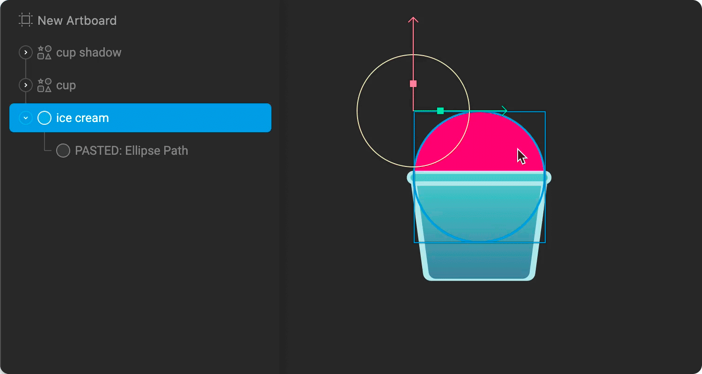
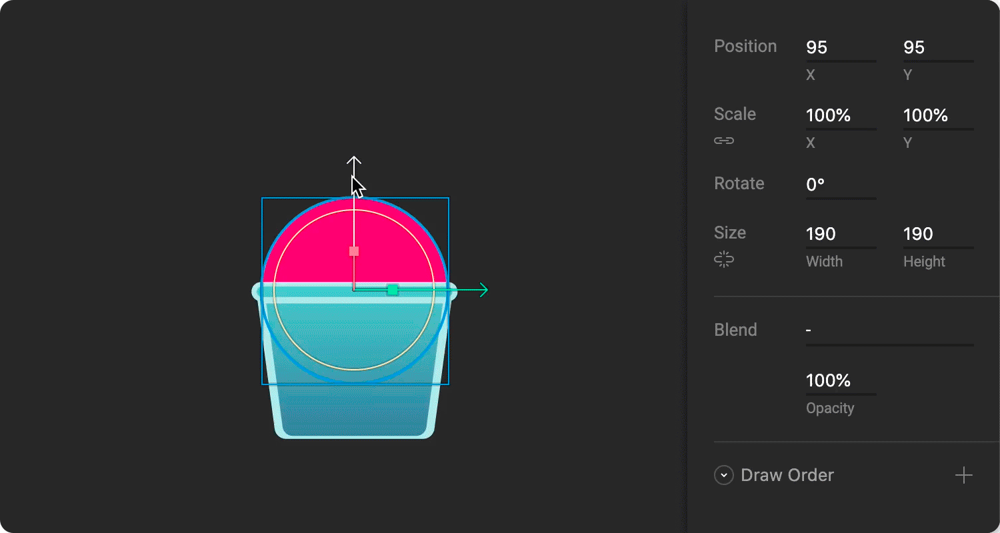

# Tips and best practices

Making good use of shapes and path helps you to create your designs in an easier way. In this example, you can find 3 different ways to use shapes and paths.

## Re-use shape layers for a simpler Hierarchy

When creating multiple paths of the same color, when possible try to use a single shape layer. This will allow you to change properties such as fill across all of the paths at once. Having more paths on the same shape layer will also keep your Hierarchy simple, which helps with performance.

**Add paths**. Add the path of a different shape to create a more complex shape.

**Duplicate paths**. Duplicate the path of the shape and edit the properties to create a more complex shape.

**Duplicate shapes**. Duplicate a shape and edit the properties of the shapes and vertex to create a texture effect.

