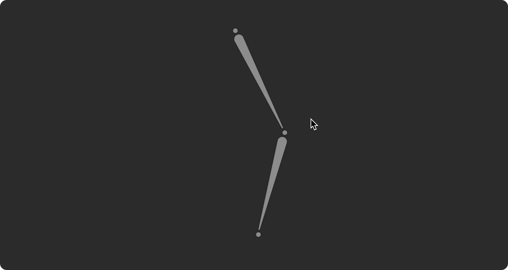
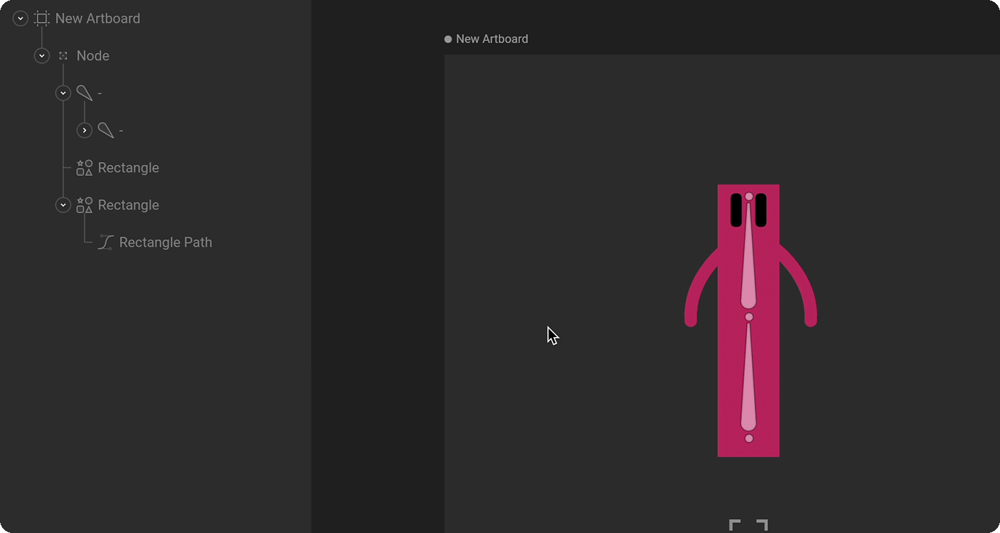

# Bones

## **Create bones**

To create a chain of bones activate the Bone tool in the [Transform Tools menu](../../fundamentals/interface-overview/toolbar.md#transform-tools-menu) \(or press `B`\) and click anywhere.

The first click is the start of the first bone. The bone appears blue as it hasn't actually been created until you click a second time. Continue this process to draw subsequent bones. Each new bone in a chain is the child of the last bone. Hit `Esc` or switch back to the select tool `V` when you're done. 

To continue the chain from a different bone, first, select the joint, then continue using the Bone tool.

## **Joints**

Joints don't exist in the hierarchy. They are controls to set up and orient bones in a chain. Moving joints change properties like length and rotation of the nearby bones.

## Root bones

The first bone in a chain is called a root bone. It is the only bone in a chain that has position X and Y properties. Other bones are defined by their length and rotation relative to their parent.

## Connecting bones to artwork

### **1. Hierarchical relationships**

The simplest way to connect shapes and images to bones is through their hierarchical relationships. Any child of a bone will transform with the bone. You can make vector shapes children of bones by dragging and dropping the shape layers onto the desired bone in the hierarchy.

### **2. Binding**

Binding is a way to connect only certain parts of your graphics to bones. This allows you to deform parts of a shape with one bone and another part of the same shape with another bone.

To begin binding shapes to bones, select a path layer, and hit enter. Doing this will activate edit vertices mode and reveal the Bind Bones option in the Inspector.

Now, hit the plus button and begin selecting bones on the stage or in the hierarchy that you want to bind to that path.

Once you've finished binding the bones, you need to weight the bones to the vertices or handles of the path. Do this by selecting a vertex and changing the percentage value to reflect the amount of influence you want a bone to have over it.

